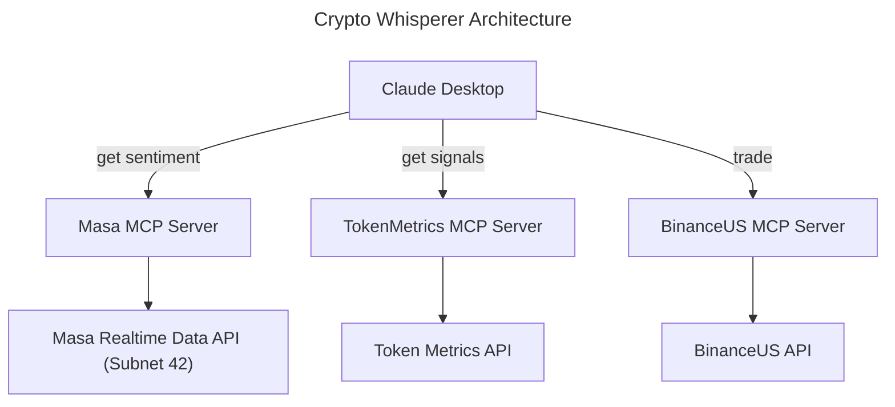

# Crypto-Whisperer: Natural Language Crypto Trading Desk

## Executive Summary

Crypto-Whisperer is an innovative application for Masa's Subnet 42 that democratizes cryptocurrency 
trading by enabling users to access realtime data, complex market data and execute trades through 
simple natural language commands. By leveraging Claude Desktop as the conversational interface and 
Subnet 42's real-time decentralized data layer, Crypto-Whisperer eliminates technical barriers to 
crypto trading while providing sophisticated market intelligence through a flexible, expandable 
architecture.

## Introduction

The cryptocurrency market demands real-time decision-making based on rapidly changing data from multiple 
sources. However, accessing and interpreting this information typically requires technical expertise, 
complex API integrations, and specialized trading interfaces. This creates a significant barrier for 
mainstream adoption of cryptocurrency trading.

Crypto-Whisperer bridges this gap by providing a natural language interface to cryptocurrency 
intelligence and trading. Users can request sentiment analysis, trading signals, and market trends 
in conversational language, and execute trades with simple commands like "buy 1 BTC." 
Our solution leverages Subnet 42's decentralized data pipelines to deliver real-time intelligence 
without requiring users to understand the underlying technical infrastructure.

By integrating three key components - Masa Realtime Data API (powered by Subnet 42 on Bittensor) 
for sentiment analysis, TokenMetrics API for trading signals, and BinanceUS API for transaction 
execution - Crypto-Whisperer demonstrates the power of the Model Context Protocol (MCP) plugin architecture. 
This modular approach allows for seamless addition of new data sources and services, creating an 
extensible platform that grows more valuable as the ecosystem expands.

Crypto-Whisperer aligns perfectly with Subnet 42's mission of providing real-time data for AI intelligence. 
By abstracting away technical complexity while maintaining access to sophisticated market insights, 
we're enabling a new generation of traders to participate in cryptocurrency markets with confidence and ease.

## Key Features & Benefits

1. **Natural Language Interface**: Users interact with complex crypto data and trading functions through simple conversations with Claude Desktop.

2. **Real-Time Intelligence**: Leverages Subnet 42's decentralized data pipelines for up-to-the-minute sentiment analysis and market signals.

3. **Simplified Trading**: Execute trades using plain English commands (e.g., "buy 1 BTC") without navigating complex exchange interfaces.

4. **Modular Architecture**: The MCP plugin structure allows for easy integration of additional data sources and services.

5. **Democratized Access**: Makes sophisticated trading tools accessible to non-technical users while maintaining depth of information.

## Technical Implementation



Our implementation demonstrates the practical application of MCP servers to create a unified interface 
for diverse data sources and services. The plugin architecture allows Claude Desktop to seamlessly 
connect to various specialized services, creating a comprehensive trading assistant that can be 
extended with additional capabilities as needed.

## Future Work
1. **Additional Data Sources**: Integrate more data sources and APIs to enhance the breadth of information available to users.
2. **User Interface Enhancements**: Develop a more sophisticated user interface for better interaction and visualization of data.
3. **Advanced Trading Strategies**: Implement more complex trading strategies and algorithms to provide users with deeper insights and recommendations.
4. **Community Engagement**: Foster a community around Crypto-Whisperer to gather feedback, suggestions, and contributions for future development.

## Installation

### Prerequisites

- Python 3.10 or higher
- A Masa Data API key (available at data.dev.masalabs.ai)
- A TokenMetrics API key (available at tokenmetrics.com)
- A BinanceUS API key (available at binance.us)

### Setup

1. Clone this repository:
   ```bash
   git clone repository_url
   cd mcp_demo
   ```
2. Create a virtual env

```
python -m venv venv
source venv/bin/activate  # On Windows: venv\Scripts\activate
```

3. Install dependencies

```
pip install -r requirements.txt
```

### Configure the MCP server for Claude Desktop

Edit ~/Library/Application\ Support/Claude/claude_desktop_config.json

```json
{
  "mcpServers": {
    "masa_mcp_server": {
            "command": "<install_directory>/venv/bin/python3",
            "args": [
                "<install_directory>/src/masa_mcp_server.py"
            ]
    },
    "token_metrics_mcp_server": {
            "command": "<install_directory>/venv/bin/python3",
            "args": [
                "<install_directory>/src/token_metrics_mcp_server.py"
            ]
    }, 
    "trading_mcp_server": {
        "command": "<install_directory>/venv/bin/python3",
            "args": [
                "<install_directory>/src/trading_mcp_server.py"
            ]
    }
  }
}
```

### Start Claude Desktop
Start the Claude Desktop application. The MCP servers will start automatically.

Check logs in ~/Library/Logs/Claude (on Mac) if there is a 
problem. Typically, it is the path part in the config file above.

### Additional Documentation 
- docs directory contains additional documentation for the project.

### Demo Conversation 
- A demo conversation with the Crypto-Whisperer can be found at
https://claude.ai/public/artifacts/89c4c1b4-f179-4dbd-b514-79aee55d4265
- A demo video of the Crypto-Whisperer can be found at https://youtu.be/BsOn3KO99cQ

## Contact
* Bin: `bin@yanezcompliance.com`
* Sid: `siddartha.a31@gmail.com`
