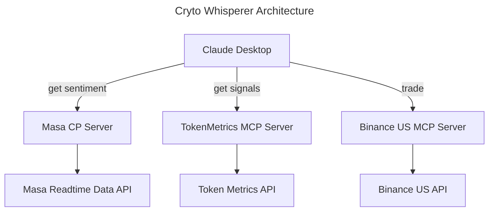

# Implementation Guide

## Architecture

Crypto-Whisperer implements a modular architecture centered around the Model Context Protocol (MCP) framework. The implementation follows a microservices approach with three primary MCP servers that handle different aspects of cryptocurrency trading and analysis:

1. **Claude Desktop Application**: Acts as the central hub that users interact with through natural language
2. **MCP Server Network**: A distributed network of specialized servers that process specific types of requests
3. **API Integration Layer**: Connects each MCP server to its respective external data or service provider

The implementation uses a RESTful API architecture for communication between components, with standardized JSON payloads for request and response handling. WebSocket connections are used where real-time data updates are required, particularly for market sentiment analysis from Subnet 42.



## Components

### 1. Claude Desktop Application

- **Natural Language Processing**: Leverages Claude's advanced NLP capabilities to interpret user requests
- **Request Router**: Determines which MCP server(s) to contact based on request type
- **Response Formatter**: Presents API responses in user-friendly natural language
- **Session Manager**: Maintains context across user interactions
- **Authentication Handler**: Securely manages user credentials for various services

### 2. Masa MCP Server

- **Sentiment Analysis Service**: Processes cryptocurrency sentiment requests, perform live twitter search, analyzes result 
- **Subnet 42 Connector**: Interfaces with Masa's realtime data API
- **Response Formatter**: Standardizes API responses for Claude consumption

### 3. TokenMetrics MCP Server

- **Signal Processor**: Search trading signals
- **API Client**: Manages authentication and communication with TokenMetrics API

### 4. BinanceUS MCP Server

- **Trade Executor**: Processes buy/sell requests

## Setup

### Prerequisites

- Python3 for MCP servers
- Access credentials for Masa Subnet 42, TokenMetrics, and BinanceUS APIs
- Claude Desktop application with MCP plugin support

### Installation Steps

1. **Clone the Repository**
   ```bash
   git clone https://github.com/webobj/crypto_whisperer
   cd crypto_whisperer
   ```

2. **Configure Environment Variables**
   ```bash
   cp .env.example .env
   # Edit .env with your API keys and configuration
   ```

3. **Install Dependencies**
   ```bash
   python -v -m venv venv
   source venv/bin/activate  # On Windows: venv\Scripts\activate
   pip install -r requirements.txt
   ```

4. **Configure the MCP server for Claude Desktop**

Edit ~/Library/Application\ Support/Claude/claude_desktop_config.json

```json
{
  "mcpServers": {
    "masa_mcp_server": {
            "command": "<install_directory>/venv/bin/python3",
            "args": [
                "<install_directory>/masa_mcp_server.py"
            ]
    },
    "token_metrics_mcp_server": {
            "command": "<install_directory>/venv/bin/python3",
            "args": [
                "<install_directory>/token_metrics_mcp_server.py"
            ]
    }, 
    "trading_mcp_server": {
        "command": "<install_directory>/venv/bin/python3",
            "args": [
                "<install_directory>/trading_mcp_server.py"
            ]
    }
  }
}
```

5. **Start Claude Desktop**
    Start the Claude Desktop application. The MCP servers will start automatically.

    Check logs in ~/Library/Logs/Claude (on Mac) if there is a problem. Typically, it is the path part in the config file above.

## Usage

### Natural Language Commands

Users interact with Crypto-Whisperer using natural language commands through the Claude Desktop interface. Here are some example commands:

#### Sentiment Analysis
```
"What's the current sentiment around Ethereum?"
"How has Bitcoin sentiment changed over the past week?"
"Which cryptocurrencies have the most positive sentiment today?"
```

#### Trading Signals
```
"What are the current trading signals for Solana?"
"What are the trading signals for BTC and SOL in the last 7 days?"
```

#### Trading Operations
```
"Buy 0.1 SOL"
```

#### Combined Analysis
```
"Should I buy Ethereum based on current data?"
"Give me a visual analysis of the data you have so far."
```

## Performance

Crypto-Whisperer is designed to leverage external services and the reasoning capabilities of the Claude Desktop 
application to provide fast and reliable responses. The main performance bottlenecks are expected to be in the
API response times from external services.

## Testing

### User Acceptance Testing
- Currently, we only conducted user acceptance testing

